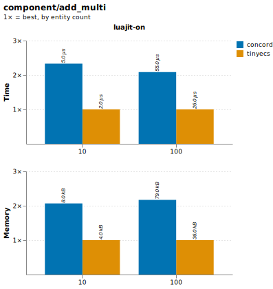
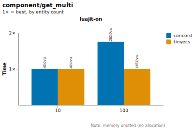
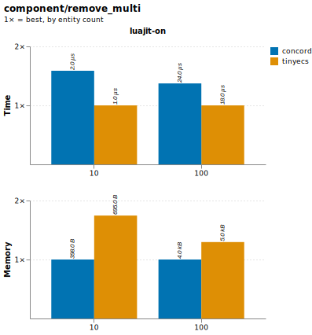
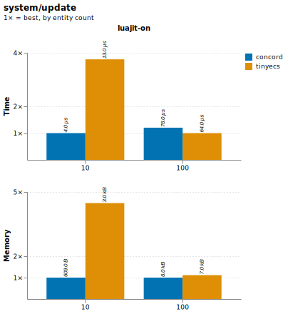

# Lua ECS Library Benchmark

## Overview

This repository hosts a benchmark suite for popular Lua ECS (Entity-Component-System) libraries, aimed at comparing their performance in terms of memory and time consumption.

## Tested Libraries

- **[tiny-ecs](https://github.com/bakpakin/tiny-ecs)**: An ECS for Lua that's simple, flexible, and useful.
- **[concord](https://github.com/Keyslam-Group/Concord)**: A feature-complete ECS for LÖVE.
- **[ecs-lua](https://github.com/nidorx/ecs-lua)**: A full-featured ECS library for Lua.
- **[nata](https://github.com/tesselode/nata)**: Entity management for Lua.

## Benchmark Tests

This repository offers a suite of benchmarks designed to evaluate various aspects of popular Entity-Component-System (ECS) frameworks used in Lua. These benchmarks are tailored to assess key functionalities of ECS frameworks, including the efficiency of update systems, adding and removing components, and the dynamics of entity creation and management.

Each test measures memory usage and time consumption. Memory usage may not reflect absolute precision but should be sufficient for relative comparisons.

While these benchmarks offer valuable insights, it's important to understand that they focus on basic functionalities and do not entirely mimic real-world usage scenarios. Features like event messaging or serialization, which aren't covered in our tests, can greatly affect a framework's overall performance and suitability. That said, the results gleaned from these tests can provide useful information, helping guide decisions in choosing the most suitable ECS framework for your Lua applications.

## Running the Benchmarks

Install:

- [Lua 5.1+](https://www.lua.org/) (or [LuaJIT](https://luajit.org/)) & [Luarocks](https://luarocks.org)
- [Python 3.12+](https://www.python.org/) & [uv](https://docs.astral.sh/uv/): required to export the results.
- [Taskfile](https://taskfile.dev/): task runner

Run benchmarks with:

```bash
task
```

Libraries are automatically installed, provided the tools above are installed.

## Results

- Frameworks with relative performance exceeding 20× the fastest are excluded from charts to improve readability.
- The results are expressed in terms of **median** execution time and memory usage; _lower is better_.

<!-- AUTO-GENERATED-CONTENT:START (OUTPUTS) -->
| Interpreter   | Markdown                                   | CSV                                          |
|:--------------|:-------------------------------------------|:---------------------------------------------|
| luajit-on     | [results.md](results/luajit-on/results.md) | [results.csv](results/luajit-on/results.csv) |
<!-- AUTO-GENERATED-CONTENT:END -->

Plots: [results/plots/](results/plots/)

### Benchmark environment

<!-- AUTO-GENERATED-CONTENT:START (BENCHMARK_ENVIRONMENT) -->
```
OS: macOS 26.2
CPU: Apple M2 Max
Cores: 12 cores (12 threads)
Max Frequency: 3.50 GHz
Memory: 64 GB
```
<!-- AUTO-GENERATED-CONTENT:END -->

### Plots

<!-- AUTO-GENERATED-CONTENT:START (PLOTS) -->
#### Component

##### add


##### add_multi


##### get


##### get_multi


##### remove


##### remove_multi


#### Entity

##### create_empty


##### create_with_components


##### destroy


#### System

##### update

<!-- AUTO-GENERATED-CONTENT:END -->

## Contributing

Contributions, including adding new tests or ECS libraries, are welcome.
