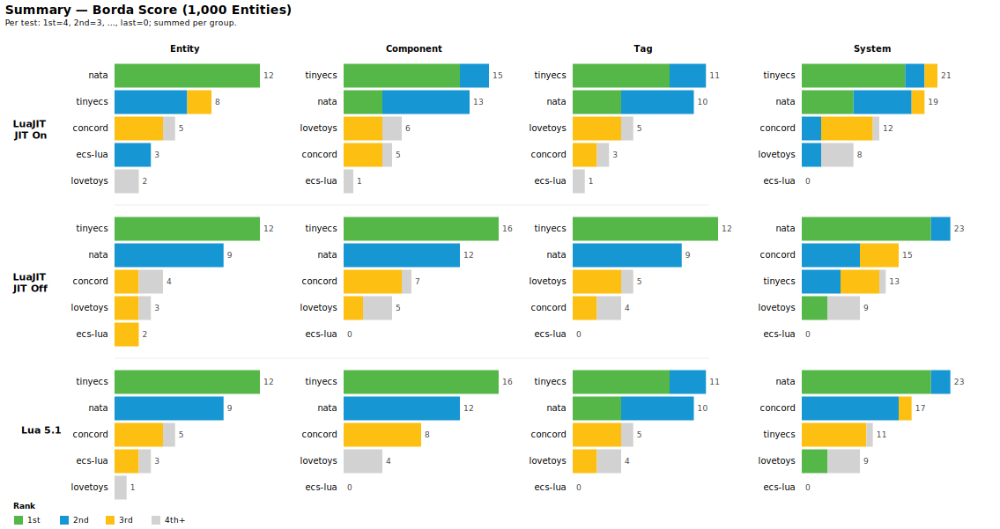

# Lua ECS Library Benchmark

## Overview

Benchmark suite measuring execution time and memory consumption of
popular Lua ECS (Entity-Component-System) libraries. Built on
[luamark](https://github.com/jeffzi/luamark), a statistical
benchmarking tool for Lua.

## Tested Libraries

| Library                                                  | Version                                                                                             |
| :------------------------------------------------------- | :-------------------------------------------------------------------------------------------------- |
| [Concord](https://github.com/Keyslam-Group/Concord)      | [`848652f`](https://github.com/Keyslam-Group/Concord/tree/848652f68887db0c4261efe499facbec88959d03) |
| [ecs-lua](https://github.com/nidorx/ecs-lua)             | [`c6be4a8`](https://github.com/nidorx/ecs-lua/tree/c6be4a85b13caf1f73facc816a08f20737e4e545)        |
| [evolved.lua](https://github.com/BlackMATov/evolved.lua) | v1.10.0-0 (luarocks)                                                                                |
| [lovetoys](https://github.com/lovetoys/lovetoys)         | v0.4.0-2 (luarocks)                                                                                 |
| [nata](https://github.com/tesselode/nata)                | [`eb9d49b`](https://github.com/tesselode/nata/tree/eb9d49bdb32b964be9419f50dfec14e9adb1bcf0)        |
| [tiny-ecs](https://github.com/bakpakin/tiny-ecs)         | v1.3-3 (luarocks)                                                                                   |

## Benchmark Tests

19 tests across 5 groups, each run at 3 entity scales (100, 1,000, 10,000):

| Group                  | Tests | Measures                                            |
| :--------------------- | ----: | :-------------------------------------------------- |
| **Entity**             |     3 | Creation, destruction, allocation cost              |
| **Component**          |     4 | Field read/write, insertion, removal                |
| **Tag**                |     3 | Presence check, insertion, removal                  |
| **System**             |     6 | Iteration throughput, scheduling, dispatch overhead |
| **Structural Scaling** |     3 | Structural ops with 20 registered systems           |

Each test reports median execution time and memory consumption.
See [specifications](docs/specifications.md) for full test definitions
and [rationale](docs/rationale.md) for test selection reasoning.

**Caveats:** These are micro-benchmarks measuring framework overhead in
isolation. They do not cover application-level concerns such as event
messaging or serialization. Memory figures suit relative comparison,
not absolute measurement.

## Running the Benchmarks

Install:

- [Lua 5.1+](https://www.lua.org/) (or [LuaJIT](https://luajit.org/))
  & [Luarocks](https://luarocks.org)
- [Python 3.12+](https://www.python.org/)
  & [uv](https://docs.astral.sh/uv/): required to export the results.
- [Taskfile](https://taskfile.dev/): task runner

Run benchmarks with:

```bash
task
```

Libraries are automatically installed, provided the tools above are installed.

## Results

- Frameworks with relative performance exceeding 20× the fastest are
  excluded from charts to improve readability.
- The results are expressed in terms of **median** execution time and
  memory usage; _lower is better_.

<!-- AUTO-GENERATED-CONTENT:START (OUTPUTS) -->

| Interpreter | Markdown                                    | CSV                                           |
| :---------- | :------------------------------------------ | :-------------------------------------------- |
| luajit-on   | [results.md](results/luajit-on/results.md)  | [results.csv](results/luajit-on/results.csv)  |
| luajit-off  | [results.md](results/luajit-off/results.md) | [results.csv](results/luajit-off/results.csv) |
| lua5.1      | [results.md](results/lua5.1/results.md)     | [results.csv](results/lua5.1/results.csv)     |

<!-- AUTO-GENERATED-CONTENT:END -->

Plots: [results/plots/](results/plots/)\
Interpreting the results: [results/README.md](results/README.md)

### Benchmark environment

<!-- AUTO-GENERATED-CONTENT:START (BENCHMARK_ENVIRONMENT) -->

```text
OS: macOS 26.3.1
CPU: Apple M2 Max
Cores: 12 cores (12 threads)
Max Frequency: 3.50 GHz
Memory: 64 GB
```

<!-- AUTO-GENERATED-CONTENT:END -->

### Summary

Overall ranking using
[Borda count](https://en.wikipedia.org/wiki/Borda_count): each framework
earns points based on its rank per test (last place = 1, first place = N).
Higher score is better. Computed across all tests at 1,000 entities,
grouped by category.

<!-- AUTO-GENERATED-CONTENT:START (SUMMARY) -->



<!-- AUTO-GENERATED-CONTENT:END -->

### Plots

Detailed per-test plots: [results/plots/](results/plots/)

## Contributing

Contributions, including adding new tests or ECS libraries, are welcome.

## License

[MIT](LICENSE)
