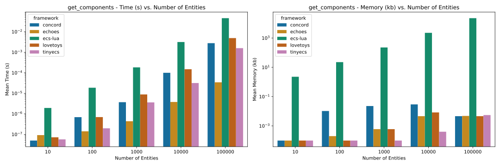

# Lua ECS Library Benchmark

## Overview

This repository hosts a benchmark suite for popular Lua ECS (Entity-Component-System) libraries, aimed at comparing their performance in terms of memory and time consumption.

## Tested Libraries

- **[tiny-ecs](https://github.com/bakpakin/tiny-ecs)**: An ECS for Lua that's simple, flexible, and useful.
- **[concord](https://github.com/Keyslam-Group/Concord)**: A feature-complete ECS for LÖVE.
- **[ecs-lua](https://github.com/nidorx/ecs-lua)**: A full-featured ECS library for Lua.
- **[nata](https://github.com/tesselode/nata)**: Entity management for Lua.
- **[echoes](https://github.com/player-03/echoes)**: A macro-based ECS framework, focusing on ease of use, written in Haxe and transpiled to Lua.

## Benchmark Tests

This repository offers a suite of benchmarks designed to evaluate various aspects of popular Entity-Component-System (ECS) frameworks used in Lua. These benchmarks are tailored to assess key functionalities of ECS frameworks, including the efficiency of update systems, adding and removing components, and the dynamics of entity creation and management.

Each test measures memory usage and time consumption. Memory usage may not reflect absolute precision but should be sufficient for relative comparisons.

While these benchmarks offer valuable insights, it's important to understand that they focus on basic functionalities and do not entirely mimic real-world usage scenarios. Features like event messaging or serialization, which aren't covered in our tests, can greatly affect a framework's overall performance and suitability. That said, the results gleaned from these tests can provide useful information, helping guide decisions in choosing the most suitable ECS framework for your Lua applications.

## Running the Benchmarks

Install:

- [Lua 5.1+](https://www.lua.org/) (or [LuaJIT](https://luajit.org/)) & [Luarocks](https://luarocks.org)
- [Haxe 4](https://haxe.org/): required to run echoes ECS.
- [Python 3.10](https://www.python.org/) & [PDM](https://pdm-project.org): required to export the results.
- [Taskfile](https://taskfile.dev/): task runner

Run benchmarks with:

```bash
task
```

Libraries are automatically installed, provided the tools above are installed.

## Results

Note:

- `nata` is not displayed in plots and not tested for entities=100000 because of the very long execution time.
- _lower is better_

### Benchmark environment

```
Lua Version: LuaJIT 2.1.1706708390 -- Copyright (C) 2005-2023 Mike Pall. https://luajit.org/
OS: Darwin
OS Version: Darwin Kernel Version 23.3.0: Wed Dec 20 21:31:00 PST 2023; root:xnu-10002.81.5~7/RELEASE_ARM64_T6020
Processor: arm64
Physical cores: 12
Total cores: 12
Min Frequency: 702.00Mhz
Max Frequency: 3504.00Mhz
Memory: 64.00GB
```

### Plots

Note that the y-axis is on a log scale.

#### add_component


#### add_components


#### add_empty_entity


#### add_entities


#### get_component


#### get_components



#### remove_component


#### remove_components


#### remove_entities


#### system_update


### Tables

#### 10 entities

##### Execution Time

| test              | concord   | echoes      | ecs-lua | lovetoys   | nata      | tinyecs     |
| :---------------- | :-------- | :---------- | :------ | :--------- | :-------- | :---------- |
| add_component     | 924 ns    | 1.83 µs     | 2.51 µs | 2.58 µs    | 312 ns    | **299 ns**  |
| add_components    | 2.56 µs   | 6.88 µs     | 8.26 µs | 7.38 µs    | 828 ns    | **730 ns**  |
| add_empty_entity  | 2.64 µs   | **1.09 µs** | 3.16 µs | 3.15 µs    | 4.29 µs   | 1.13 µs     |
| add_entities      | 4.44 µs   | 5.3 µs      | 8.85 µs | 5.01 µs    | 4.6 µs    | **1.51 µs** |
| get_component     | 54 ns     | 90 ns       | 175 ns  | 66 ns      | 44 ns     | **43 ns**   |
| get_components    | **50 ns** | 92 ns       | 1.94 µs | 72 ns      | 56 ns     | 57 ns       |
| remove_component  | 1.83 µs   | 2.99 µs     | 2.54 µs | 100 ns     | 52 ns     | **51 ns**   |
| remove_components | 2.24 µs   | 7.12 µs     | 4.34 µs | 98 ns      | **52 ns** | 54 ns       |
| remove_entities   | 3.6 µs    | 6.14 µs     | 559 ns  | **406 ns** |           | 1.39 µs     |
| system_update     | 242 ns    | 211 ns      | 1.13 µs | 205 ns     | 303 ns    | **76 ns**   |

##### Memory Usage

| test              | concord | echoes    | ecs-lua | lovetoys | nata       | tinyecs    |
| :---------------- | :------ | :-------- | :------ | :------- | :--------- | :--------- |
| add_component     | 2.5 kB  | 8.2 kB    | 3.8 kB  | 2.9 kB   | **1.6 kB** | 1.6 kB     |
| add_components    | 7.5 kB  | 12.4 kB   | 13.4 kB | 7.8 kB   | 3.8 kB     | **3.1 kB** |
| add_empty_entity  | 3.9 kB  | **390 B** | 9.2 kB  | 5.3 kB   | 2.0 kB     | 1.8 kB     |
| add_entities      | 9.9 kB  | 12.8 kB   | 20.0 kB | 9.4 kB   | 4.2 kB     | **4.0 kB** |
| get_component     | **0 B** | 0 B       | 859 B   | 0 B      | 0 B        | 0 B        |
| get_components    | **0 B** | 0 B       | 2.3 kB  | 0 B      | 0 B        | 0 B        |
| remove_component  | 444 B   | **0 B**   | 1.7 kB  | 0 B      | 0 B        | 0 B        |
| remove_components | 467 B   | **0 B**   | 2.1 kB  | 0 B      | 0 B        | 0 B        |
| remove_entities   | 918 B   | 4.8 kB    | 1.1 kB  | **0 B**  |            | 703 B      |
| system_update     | **0 B** | 43 B      | 2.2 kB  | 0 B      | 117 B      | 0 B        |

#### 100 entities

##### Execution Time

| test              | concord | echoes      | ecs-lua     | lovetoys | nata    | tinyecs     |
| :---------------- | :------ | :---------- | :---------- | :------- | :------ | :---------- |
| add_component     | 9.36 µs | 43.5 µs     | 23.9 µs     | 24.5 µs  | 2.77 µs | **2.62 µs** |
| add_components    | 26.8 µs | 100 µs      | 99.5 µs     | 70.6 µs  | 7.72 µs | **6.93 µs** |
| add_empty_entity  | 64.6 µs | **11.6 µs** | 34.8 µs     | 39.2 µs  | 131 µs  | 12.7 µs     |
| add_entities      | 79.6 µs | 58.1 µs     | 109 µs      | 93.3 µs  | 145 µs  | **35 µs**   |
| get_component     | 503 ns  | 145 ns      | 1.42 µs     | 558 ns   | 161 ns  | **119 ns**  |
| get_components    | 690 ns  | **141 ns**  | 18.7 µs     | 695 ns   | 229 ns  | 197 ns      |
| remove_component  | 56.6 µs | 28.7 µs     | 26.3 µs     | 840 ns   | 148 ns  | **126 ns**  |
| remove_components | 101 µs  | 75.7 µs     | 44.4 µs     | 929 ns   | 193 ns  | **156 ns**  |
| remove_entities   | 97.5 µs | 111 µs      | **1.91 µs** | 11.6 µs  |         | 20.3 µs     |
| system_update     | 391 ns  | 286 ns      | 2.92 µs     | 671 ns   | 299 ns  | **242 ns**  |

##### Memory Usage

| test              | concord | echoes     | ecs-lua  | lovetoys | nata    | tinyecs     |
| :---------------- | :------ | :--------- | :------- | :------- | :------ | :---------- |
| add_component     | 25.0 kB | 82.0 kB    | 37.5 kB  | 28.9 kB  | 15.6 kB | **15.6 kB** |
| add_components    | 75.0 kB | 124.2 kB   | 133.6 kB | 78.1 kB  | 37.5 kB | **31.2 kB** |
| add_empty_entity  | 39.6 kB | **3.9 kB** | 73.3 kB  | 58.3 kB  | 13.0 kB | 12.0 kB     |
| add_entities      | 99.1 kB | 128.1 kB   | 181.1 kB | 113.6 kB | 39.0 kB | **38.0 kB** |
| get_component     | 8 B     | 0 B        | 8.6 kB   | **0 B**  | 0 B     | 0 B         |
| get_components    | 10 B    | 0 B        | 22.7 kB  | **0 B**  | 0 B     | 0 B         |
| remove_component  | 5.4 kB  | **0 B**    | 17.2 kB  | 0 B      | 0 B     | 0 B         |
| remove_components | 5.5 kB  | 0 B        | 21.1 kB  | **0 B**  | 0 B     | 0 B         |
| remove_entities   | 11.2 kB | 47.7 kB    | 1.2 kB   | **0 B**  |         | 5.1 kB      |
| system_update     | **0 B** | 51 B       | 9.7 kB   | 0 B      | 117 B   | 0 B         |

#### 1000 entities

##### Execution Time

| test              | concord | echoes      | ecs-lua     | lovetoys | nata        | tinyecs     |
| :---------------- | :------ | :---------- | :---------- | :------- | :---------- | :---------- |
| add_component     | 85.7 µs | 434 µs      | 237 µs      | 238 µs   | 28.6 µs     | **25.2 µs** |
| add_components    | 244 µs  | 997 µs      | 976 µs      | 734 µs   | 75.7 µs     | **66.1 µs** |
| add_empty_entity  | 496 µs  | **88.5 µs** | 285 µs      | 430 µs   | 7.24 ms     | 135 µs      |
| add_entities      | 731 µs  | 844 µs      | 1.04 ms     | 1.1 ms   | 7.52 ms     | **385 µs**  |
| get_component     | 2.79 µs | **447 ns**  | 13.7 µs     | 6.97 µs  | 1.79 µs     | 2.07 µs     |
| get_components    | 3.69 µs | **435 ns**  | 183 µs      | 8.83 µs  | 3.38 µs     | 3.61 µs     |
| remove_component  | 325 µs  | 286 µs      | 263 µs      | 9.65 µs  | **2.01 µs** | 2.29 µs     |
| remove_components | 527 µs  | 783 µs      | 440 µs      | 11.4 µs  | **3.28 µs** | 3.52 µs     |
| remove_entities   | 631 µs  | 1.1 ms      | **8.61 µs** | 111 µs   |             | 193 µs      |
| system_update     | 5.5 µs  | 12.3 µs     | 23 µs       | 12.5 µs  | **290 ns**  | 4.65 µs     |

##### Memory Usage

| test              | concord  | echoes      | ecs-lua  | lovetoys | nata     | tinyecs      |
| :---------------- | :------- | :---------- | :------- | :------- | :------- | :----------- |
| add_component     | 250.1 kB | 820.3 kB    | 375.0 kB | 289.1 kB | 156.3 kB | **156.2 kB** |
| add_components    | 750.1 kB | 1.2 MB      | 1.3 MB   | 781.2 kB | 375.0 kB | **312.5 kB** |
| add_empty_entity  | 377.2 kB | **39.1 kB** | 691.7 kB | 578.5 kB | 111.5 kB | 103.8 kB     |
| add_entities      | 971.1 kB | 1.3 MB      | 1.8 MB   | 1.1 MB   | 376.3 kB | **368.3 kB** |
| get_component     | 16 B     | 0 B         | 85.9 kB  | 0 B      | 3 B      | **0 B**      |
| get_components    | 22 B     | 0 B         | 226.6 kB | 0 B      | 3 B      | **0 B**      |
| remove_component  | 37.8 kB  | 0 B         | 171.9 kB | 0 B      | 3 B      | **0 B**      |
| remove_components | 37.6 kB  | 0 B         | 210.9 kB | 0 B      | 3 B      | **0 B**      |
| remove_entities   | 76.6 kB  | 476.6 kB    | 1.2 kB   | **0 B**  |          | 40.1 kB      |
| system_update     | **0 B**  | 93 B        | 87.1 kB  | 0 B      | 117 B    | 0 B          |

#### 10000 entities

##### Execution Time

| test              | concord | echoes      | ecs-lua    | lovetoys | nata       | tinyecs     |
| :---------------- | :------ | :---------- | :--------- | :------- | :--------- | :---------- |
| add_component     | 801 µs  | 4.3 ms      | 2.51 ms    | 2.43 ms  | 277 µs     | **251 µs**  |
| add_components    | 2.3 ms  | 9.89 ms     | 9.65 ms    | 7.16 ms  | 774 µs     | **675 µs**  |
| add_empty_entity  | 5.2 ms  | **899 µs**  | 2.85 ms    | 5.22 ms  | 619 ms     | 1.39 ms     |
| add_entities      | 6.37 ms | 8.32 ms     | 10.2 ms    | 11.4 ms  | 648 ms     | **2.55 ms** |
| get_component     | 42.8 µs | **3.54 µs** | 443 µs     | 112 µs   | 17.4 µs    | 14.6 µs     |
| get_components    | 99.8 µs | **3.79 µs** | 3.15 ms    | 149 µs   | 32.1 µs    | 31.7 µs     |
| remove_component  | 2.38 ms | 3.02 ms     | 3.38 ms    | 177 µs   | 20.1 µs    | **17.8 µs** |
| remove_components | 3.31 ms | 8.25 ms     | 5.32 ms    | 180 µs   | 54.2 µs    | **31.3 µs** |
| remove_entities   | 5.36 ms | 11.7 ms     | **110 µs** | 1.14 ms  |            | 2.08 ms     |
| system_update     | 60.7 µs | 122 µs      | 253 µs     | 134 µs   | **299 ns** | 45.2 µs     |

##### Memory Usage

| test              | concord  | echoes       | ecs-lua  | lovetoys | nata   | tinyecs    |
| :---------------- | :------- | :----------- | :------- | :------- | :----- | :--------- |
| add_component     | 2.5 MB   | 8.2 MB       | 3.8 MB   | 2.9 MB   | 1.6 MB | **1.6 MB** |
| add_components    | 7.5 MB   | 12.4 MB      | 13.4 MB  | 7.8 MB   | 3.8 MB | **3.1 MB** |
| add_empty_entity  | 4.0 MB   | **390.6 kB** | 7.5 MB   | 5.9 MB   | 1.4 MB | 1.2 MB     |
| add_entities      | 10.0 MB  | 12.8 MB      | 18.3 MB  | 11.4 MB  | 4.0 MB | **3.9 MB** |
| get_component     | 30 B     | 4 B          | 859.4 kB | 8 B      | 8 B    | **0 B**    |
| get_components    | 29 B     | 4 B          | 2.3 MB   | 8 B      | 4 B    | **0 B**    |
| remove_component  | 461.5 kB | 3 B          | 1.7 MB   | 8 B      | 8 B    | **0 B**    |
| remove_components | 462.9 kB | 3 B          | 2.1 MB   | 8 B      | 8 B    | **0 B**    |
| remove_entities   | 930.1 kB | 4.8 MB       | 1.2 kB   | **0 B**  |        | 576.1 kB   |
| system_update     | **0 B**  | 93 B         | 860.6 kB | 0 B      | 117 B  | 0 B        |

#### 100000 entities

##### Execution Time

| test              | concord | echoes      | ecs-lua     | lovetoys | nata | tinyecs     |
| :---------------- | :------ | :---------- | :---------- | :------- | :--- | :---------- |
| add_component     | 8.27 ms | 16.6 ms     | 22.9 ms     | 23.6 ms  |      | **2.56 ms** |
| add_components    | 23.6 ms | 45.4 ms     | 79.2 ms     | 71.2 ms  |      | **6.57 ms** |
| add_empty_entity  | 42.1 ms | **8.74 ms** | 40.8 ms     | 22.8 ms  |      | 14.7 ms     |
| add_entities      | 71.3 ms | 56.6 ms     | 111 ms      | 64.4 ms  |      | **20.9 ms** |
| get_component     | 1.28 ms | **32.6 µs** | 11.5 ms     | 4.6 ms   |      | 835 µs      |
| get_components    | 2.78 ms | **34.5 µs** | 45.8 ms     | 4.9 ms   |      | 1.59 ms     |
| remove_component  | 41.9 ms | 38.5 ms     | 31.1 ms     | 5.87 ms  |      | **949 µs**  |
| remove_components | 33.5 ms | 91 ms       | 44.3 ms     | 6.34 ms  |      | **1.17 ms** |
| remove_entities   | 71.7 ms | 115 ms      | **3.18 ms** | 11 ms    |      | 19.7 ms     |
| system_update     | 3.53 ms | 5.75 ms     | 12 ms       | 6.41 ms  |      | **1.23 ms** |

##### Memory Usage

| test              | concord | echoes     | ecs-lua  | lovetoys | nata | tinyecs     |
| :---------------- | :------ | :--------- | :------- | :------- | :--- | :---------- |
| add_component     | 25.0 MB | 82.0 MB    | 37.5 MB  | 28.9 MB  |      | **15.6 MB** |
| add_components    | 75.0 MB | 124.2 MB   | 133.6 MB | 78.1 MB  |      | **31.3 MB** |
| add_empty_entity  | 39.4 MB | **3.9 MB** | 71.9 MB  | 52.0 MB  |      | 11.4 MB     |
| add_entities      | 98.8 MB | 128.1 MB   | 179.7 MB | 107.2 MB |      | **37.9 MB** |
| get_component     | 7 B     | **4 B**    | 8.6 MB   | 4 B      |      | 7 B         |
| get_components    | **4 B** | 4 B        | 22.7 MB  | 4 B      |      | 5 B         |
| remove_component  | 4.1 MB  | **0 B**    | 17.2 MB  | 4 B      |      | 8 B         |
| remove_components | 4.1 MB  | **0 B**    | 21.1 MB  | 4 B      |      | 8 B         |
| remove_entities   | 8.2 MB  | 47.7 MB    | 1.2 kB   | **4 B**  |      | 5.1 MB      |
| system_update     | 18 B    | 123 B      | 8.5 MB   | **4 B**  |      | 4 B         |

## Contributing

Contributions, including adding new tests or ECS libraries, are welcome.
