# Benchmark Plots

```text
OS: macOS 26.2
CPU: Apple M2 Max
Cores: 12 cores (12 threads)
Max Frequency: 3.50 GHz
Memory: 64 GB
```

Memory rows are omitted from charts when all frameworks report zero allocation for a given test.

- **[Entity](#entity):** [create_empty](#entity-create_empty) · [create_with_components](#entity-create_with_components) · [destroy](#entity-destroy)
- **[Component](#component):** [get](#component-get) · [set](#component-set) · [add](#component-add) · [remove](#component-remove)
- **[Tag](#tag):** [has](#tag-has) · [add](#tag-add) · [remove](#tag-remove)
- **[System](#system):** [throughput](#system-throughput) · [overlap](#system-overlap) · [fragmented](#system-fragmented) · [chained](#system-chained) · [multi_20](#system-multi_20) · [empty_systems](#system-empty_systems)

#### Entity

<a id="entity-create_empty"></a>

##### create_empty

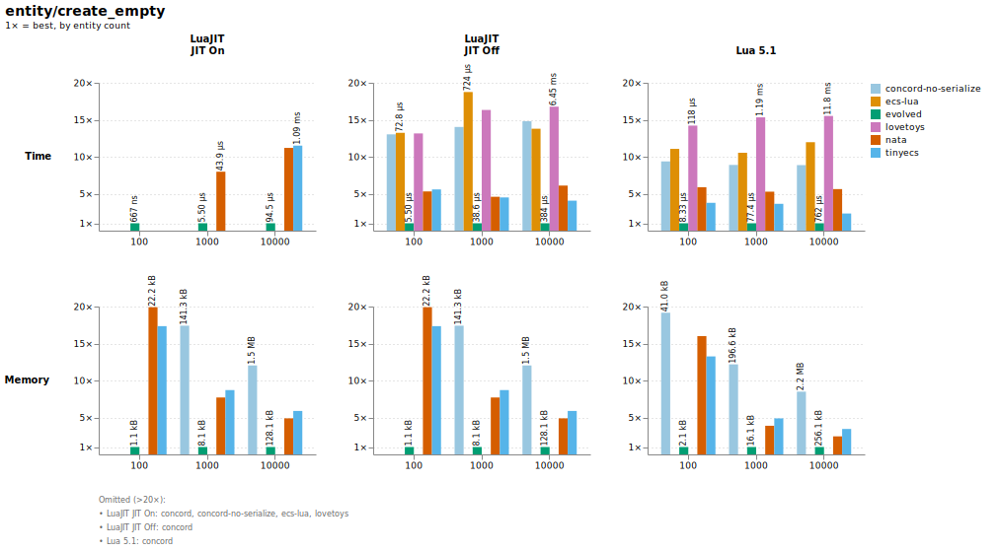

<a id="entity-create_with_components"></a>

##### create_with_components

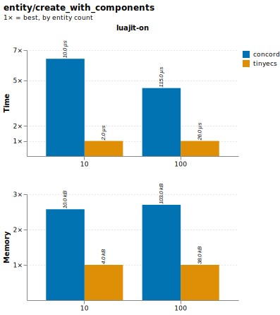

<a id="entity-destroy"></a>

##### destroy

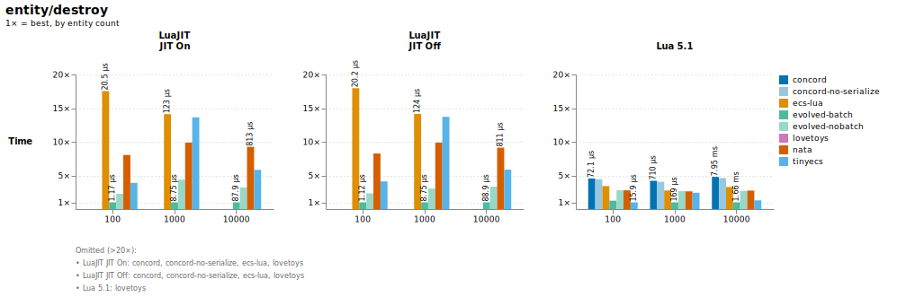

#### Component

<a id="component-get"></a>

##### get

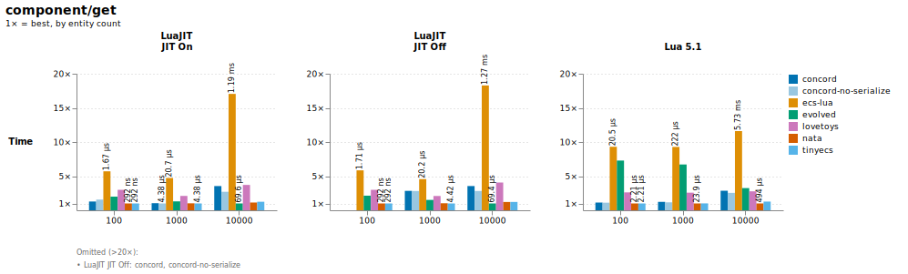

<a id="component-set"></a>

##### set

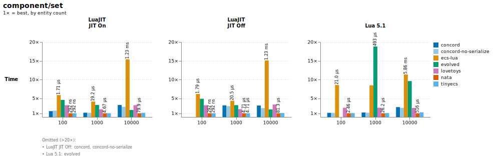

<a id="component-add"></a>

##### add

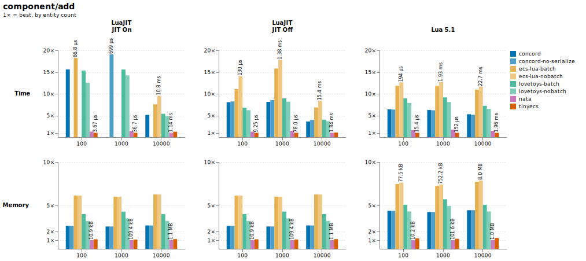

<a id="component-remove"></a>

##### remove

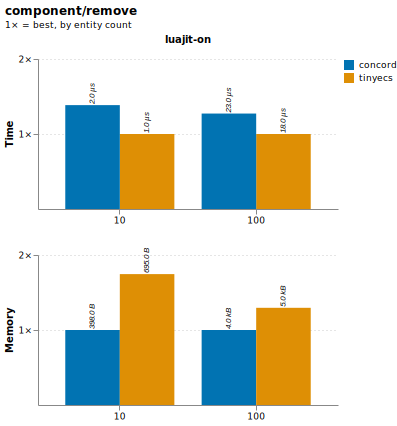

#### Tag

<a id="tag-has"></a>

##### has

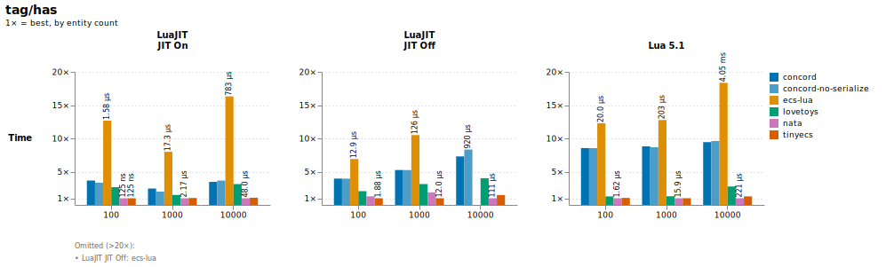

<a id="tag-add"></a>

##### add

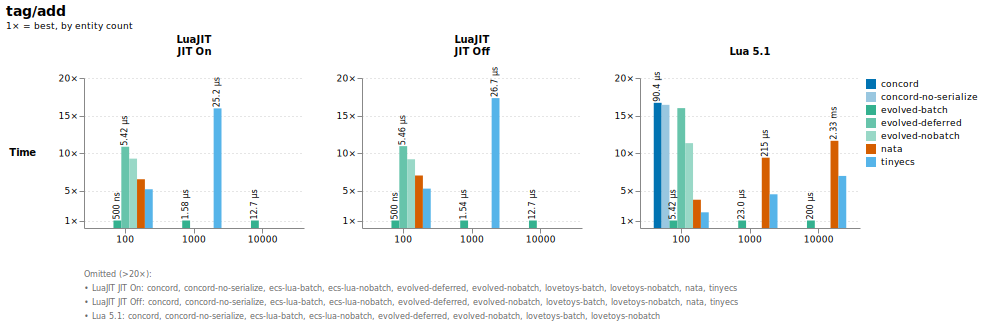

<a id="tag-remove"></a>

##### remove

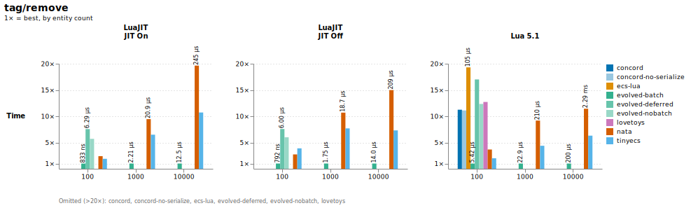

#### System

<a id="system-throughput"></a>

##### throughput

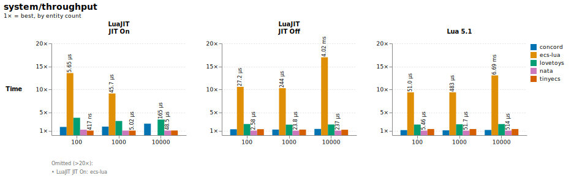

<a id="system-overlap"></a>

##### overlap

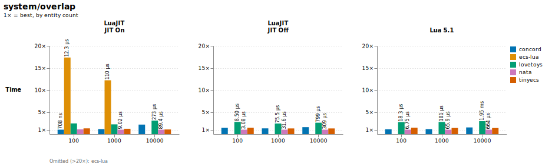

<a id="system-fragmented"></a>

##### fragmented

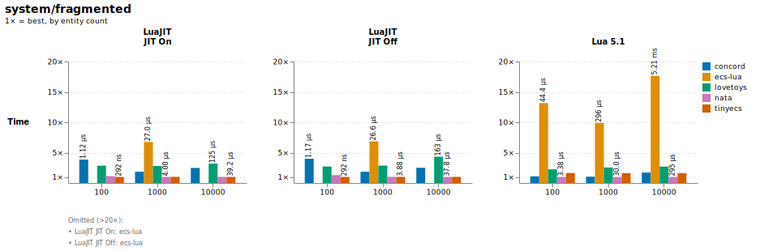

<a id="system-chained"></a>

##### chained

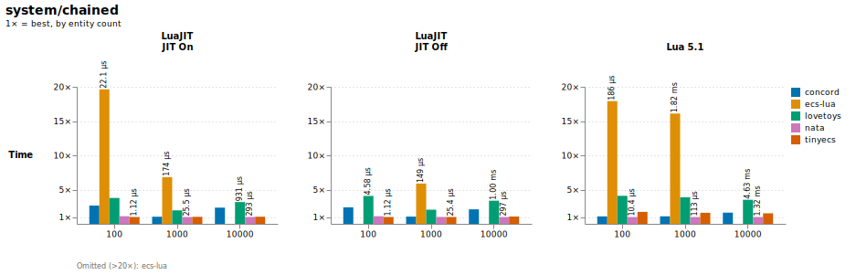

<a id="system-multi_20"></a>

##### multi_20

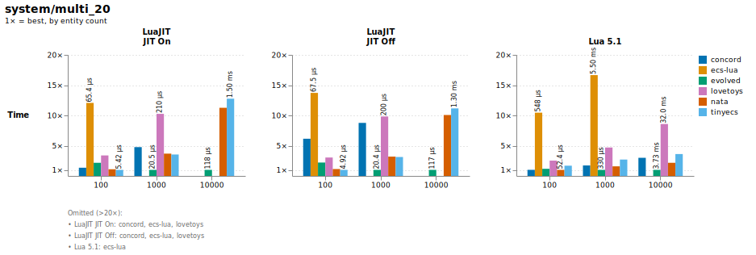

<a id="system-empty_systems"></a>

##### empty_systems

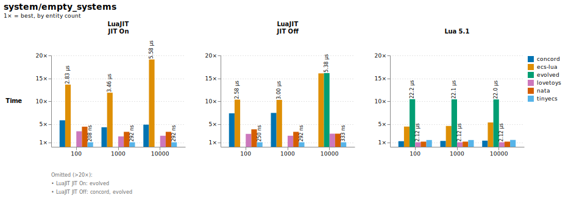
